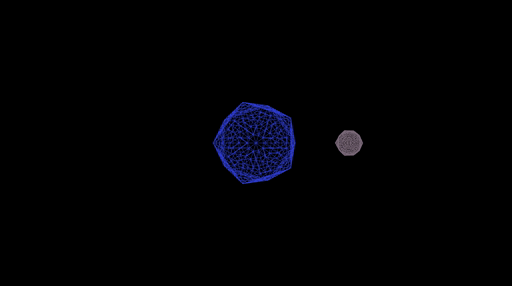

# GraphicsDemos
Multiple demo programs exploring the basics of computer graphics (Completed using the CSC317 course offered at UofT. Assignment READMEs are included)

## Rasterization

  
   

## Ray Casting

  

## Ray Tracing

  
   

## Meshes

  
   

## Bounding Volumes

  
   

## Shader Pipeline

  
   
   

## Kinematics

  
   
   

## Mass Spring Systems

  
   

